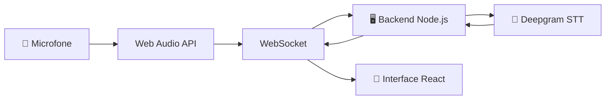

# 🎤 Etapa 01 - Transcrição Básica


## 🎯 Objetivo

Primeira etapa do workshop focada em **transcrição básica de áudio em tempo real** usando Deepgram.

## ✨ Funcionalidades

- **🎤 Captura de áudio** com Web Audio API (AudioContext)
- **📝 Transcrição em tempo real** com Deepgram
- **🌐 Comunicação WebSocket** bidirecional
- **🎨 Interface moderna** com React + TypeScript

## 🏗️ Arquitetura



## 🚀 Como Executar

### Pré-requisitos
- Node.js 18+
- Conta Deepgram (gratuita)

### Instalação

```bash
# Backend
cd etapa-01/backend
npm install

# Frontend (novo terminal)
cd etapa-01/frontend
npm install
```

### Configuração

Crie `.env` no backend:

```env
DEEPGRAM_API_KEY=sua_chave_deepgram_aqui
PORT=3001
CORS_ORIGIN=http://localhost:5173
```

### Execução

```bash
# Backend
npm run dev

# Frontend (novo terminal)
npm run dev
```

## 🎓 O que Você Aprende

1. **Web Audio API** - Captura avançada de áudio
2. **WebSocket Real-time** - Comunicação bidirecional
3. **Speech-to-Text** - Integração com Deepgram
4. **React + TypeScript** - Interface moderna
5. **Node.js Backend** - Servidor WebSocket

## 📚 Documentação Detalhada

```{toctree}
:maxdepth: 1

frontend
backend
troubleshooting
```

---

➡️ **Próxima etapa**: [Etapa 02 - IA Conversacional](../etapa-02/index.md)