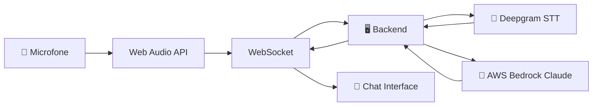

# 🤖 Etapa 02 - IA Conversacional


## 🎯 Objetivo

Segunda etapa que adiciona **inteligência conversacional** às transcrições usando AWS Bedrock Claude.

## ✨ Funcionalidades

- **🎤 Tudo da Etapa 01** (áudio + transcrição)
- **🤖 IA Conversacional** com AWS Bedrock Claude Sonnet 4
- **💬 Interface de chat** inteligente
- **🧠 Contexto conversacional** mantido

## 🏗️ Arquitetura



## 🚀 Como Executar

### Pré-requisitos
- Tudo da Etapa 01
- Conta AWS com acesso ao Bedrock

### Configuração Adicional

Adicione ao `.env` do backend:

```env
# AWS Bedrock Configuration
AWS_REGION=us-east-1
AWS_ACCESS_KEY_ID=sua_aws_access_key
AWS_SECRET_ACCESS_KEY=sua_aws_secret_key
BEDROCK_MODEL_ID=anthropic.claude-3-5-sonnet-20241022-v2:0
```

### Setup AWS Bedrock

1. Acesse [AWS Console](https://console.aws.amazon.com)
2. Habilite Amazon Bedrock na região us-east-1
3. Configure acesso ao Claude Sonnet 4
4. Crie credenciais IAM com permissões Bedrock

## 🎓 O que Você Aprende (Novo)

1. **AWS Bedrock Integration** - Acesso ao Claude via API
2. **Conversational AI** - Contexto entre mensagens
3. **Service Orchestration** - Pipeline STT → AI
4. **Chat Interface** - UI conversacional moderna
5. **Session Management** - Contexto por usuário

## 🔄 Fluxo Conversacional

1. **Usuário fala** → Transcrição em tempo real
2. **Texto transcrito** → Enviado para Claude
3. **Claude processa** → Gera resposta inteligente
4. **Resposta exibida** → Interface de chat
5. **Contexto mantido** → Conversa fluida

## 📚 Documentação Detalhada

```{toctree}
:maxdepth: 1

frontend
backend
aws-setup
troubleshooting
```

---

⬅️ **Etapa anterior**: [Etapa 01 - Transcrição Básica](../etapa-01/index.md)
➡️ **Próxima etapa**: [Etapa 03 - Workshop Completo](../etapa-03/index.md)