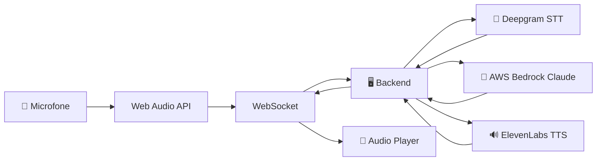

# 🎖️ Etapa 03 - Workshop Completo


## 🎯 Objetivo

**Versão final e completa** do workshop com conversa 100% por voz usando ElevenLabs TTS.

## ✨ Funcionalidades Completas

- **🎤 Tudo das Etapas 01 e 02**
- **🔊 Text-to-Speech** com ElevenLabs
- **💬 Conversa completa por voz** (STT → IA → TTS)
- **🎵 Reprodução automática** das respostas
- **✨ Interface polida** e profissional

## 🏗️ Arquitetura Completa



## 🚀 Como Executar

### Pré-requisitos Completos
- Tudo das Etapas 01 e 02
- Conta ElevenLabs

### Configuração Completa

Complete o `.env` do backend:

```env
# Deepgram (STT)
DEEPGRAM_API_KEY=sua_chave_deepgram

# AWS Bedrock (IA)
AWS_REGION=us-east-1
AWS_ACCESS_KEY_ID=sua_aws_access_key
AWS_SECRET_ACCESS_KEY=sua_aws_secret_key
BEDROCK_MODEL_ID=anthropic.claude-3-5-sonnet-20241022-v2:0

# ElevenLabs (TTS)
ELEVENLABS_API_KEY=sua_chave_elevenlabs
ELEVENLABS_VOICE_ID=EXAVITQu4vr4xnSDxMaL
ELEVENLABS_MODEL=eleven_multilingual_v2
```

### Setup ElevenLabs

1. Acesse [ElevenLabs](https://elevenlabs.io)
2. Crie conta e navegue até Profile → API Key
3. Use voice ID padrão ou escolha uma voz

## 🎓 O que Você Aprende (Final)

1. **Text-to-Speech Integration** - ElevenLabs API
2. **Complete Voice Pipeline** - STT → AI → TTS
3. **Audio Processing** - Base64 encoding/decoding
4. **Real-time Audio Playback** - Web Audio API output
5. **Production Architecture** - Sistema completo

## 🔄 Fluxo Completo

1. **🎤 Usuário fala** → Captura de áudio
2. **📝 Transcrição** → Deepgram STT
3. **🤖 IA processa** → Claude gera resposta
4. **🔊 Síntese de voz** → ElevenLabs TTS
5. **🎵 Reprodução** → Resposta em áudio
6. **🔄 Ciclo continua** → Conversa natural

## 🎉 Resultado Final

Uma aplicação completa de **conversação por voz** que:

- **Entende** o que você fala (STT)
- **Pensa** com inteligência artificial (Claude)
- **Responde** com voz natural (TTS)
- **Mantém** contexto conversacional
- **Funciona** em tempo real

## 📚 Documentação Detalhada

```{toctree}
:maxdepth: 1

frontend
backend
elevenlabs-setup
deployment
troubleshooting
```

---

⬅️ **Etapa anterior**: [Etapa 02 - IA Conversacional](../etapa-02/index.md)

**🎉 Esta é a versão final do workshop!**

## 🏆 Parabéns!

Você completou o workshop e agora tem uma aplicação completa de IA conversacional! 🚀